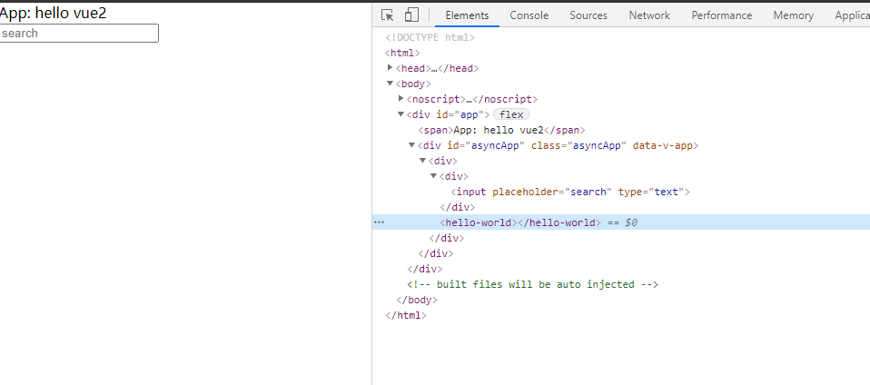

# intruction
A demo of vue2 uses vue3 components with webpack module federation

## source structure

- vue2: the project of vue2
  - build: the config of the vue2 project
  - src: the source code of vue2 project
- vue3: the project of vue3
  - build: the config of the vue3 project
  - src: the source code of vue3 project

more details:

1. vue2 mf config
```
vue2\build\config\module-federation.conf.js
```

2. vue2 component use vue3 component 
```
vue2\src\pages\Test.vue
```

3. vue3 mf config
```
vue3\build\config\module-federation-base.conf.js
```

4. vue3 component source code
```
vue3\src\pages\main.vue
```

5. vue3 component use vue3 component in the same project
```
vue3\src\pages\test.vue
```
## how to start
```
cd vue3
npm install
npm start

cd vue2
npm install
npm start

```

## result

the component in vue3
<center>


the component used in vue2
<center>


